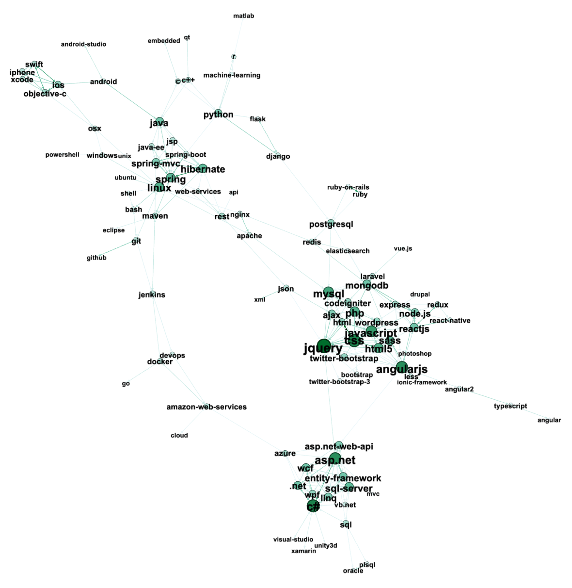

# Stack Overflow Trends

## Recommendations API /w Neo4j & Go

**Petr Ježek, 2024, VŠE FIS**

*Stack Overflow Trends je serverová aplikace nad grafovou databází, která umožňuje provádět dotazy na relevanci tagů ze Stack Overflow a doporučení souvisejících technologií na základě zvoleného tagu.*

### Spuštění

Aplikace je kontejnerizovaná pomocí Dockeru. Je třeba verze `Docker version 26.1.1, build 4cf5afa` či vyšší včetně `docker-compose`.

Celá aplikace pak lze pustit z pracovního adresáře pomocí `docker compose up -d`

REST API je pak dostupné na adrese http://localhost:8080/
Neo4j browser poběží na http://localhost:7474/browser/

### Data

Aplikace využívá open data z Kaggle, konkrétně dataset https://www.kaggle.com/datasets/stackoverflow/stack-overflow-tag-network/data.

Data jsou ve formátu `.csv` a obsahují dva soubory. Soubor `stack_network_nodes.csv`  obsahuje údaje o štítcích (tags), jejich jméno (name), četnost výskytu (size) a skupinu (group), která je předpočítána pomocí cluster walktrap algoritmu. Soubor `stack_network_links.csv` obsahuje údaje o hranách, které reprezentují spojitost tagů na základě jejich společného výskytu ve Stack Overflow příspěvcích. Krom jména zdrojového (source) tagu a cílového (target) tagu obsahují ještě hodnotu (value), která reprezentuje korelaci společného výskytu těchto dvou tagů.

### Předzpracování dat

Pro práci s grafovými daty jsem data nejprve načetl z formátu `.csv`. K tomuto účelu slouží skript `scripts/init.go`.

Po rozbalení dat z Kaggle do složky `data/` (viz. `data/SOURCE.md`) můžeme spustit aplikaci pomocí `docker compose up -d`. **Aplikace při opětovném spuštění smaže vše z databáze a nahraje data ze souborů CSV.**

Funkce `loadCSVRecords(fpath string)` načte z dané cesty k souboru data do dvojrozměrného pole.
```go
func loadCSVRecords(fpath string) [][]string {
	file, err := os.Open(fpath)
	if err != nil {
		log.Fatal(err)
	}

	defer file.Close()

	csvReader := csv.NewReader(file)
	records, err := csvReader.ReadAll()
	if err != nil {
		log.Fatal(err)
	}

	return records
}
```

Stejná funkce je použita pro načtení uzlů i hran.

```go
  // load and insert nodes, create links
	nodeRecords := loadCSVRecords(NODES_FNAME)
	linkRecords := loadCSVRecords(LINKS_FNAME)
```

Dále jsou vytvořeny uzly a hrany pomocí funkcí `insertNodes(...)` a `createLinks(...)`, které volají databázovou vrstvu aplikace.

```go
func insertNodes(ctx context.Context, 
repo n4j.SoNodeRepository, records [][]string) {
  // skip header line of csv by taking a [1:] array slice
	for _, record := range records[1:] {
    // parse node data from record
		node, err := parseNodeFromRecord(record)
		if err != nil {
			panic(err)
		}

    // use repository layer to execute insert CYPHER query
		_, err = repo.InsertNode(ctx, node)
		if err != nil {
			panic(err)
		}
	}
  ...
```

Databázová vrstva je definována v souboru `internal/db/neo4j/so_repository.go`. Zde najdeme všechny funkce spouštějící CYPHER dotazy nad databází. Připojení k databázi je implementováno v souboru `internal/db/neo4j/conn.go`.

Funkci `InsertNode(...)` využívá dotazu `CREATE (n:Node { name: $name, group: $group, size: $size }) RETURN n`, který vytvoří nový uzel s danými atributy a vrátí ho jako výsledek.

Pro vytvoření hrany je nejprve zkontrolováno, že potřebné uzly již existují. K tomuto účlu slouží funkce `FindNodesByName(...)`, která spustí dotaz `MATCH (n) WHERE n.name = $name RETURN n` a vrátí výsledky. Protože většina dotazů vrací seznam uzlů, je implementována pomocná funkce `createNodesFromResult(...)` která provede parsing výsledku do seznamu uzlů. Uzel je reprezentován structem `Node`, který obsahuje navíc slovník `Metadata`, který slouží u komplexnějších dotazů k uchování dodatečných informací o uzlu.

```go
type Node struct {
	Name     string                 `json:"name"`
	Group    int64                  `json:"group"`
	Size     float64                `json:"size"`
	Metadata map[string]interface{} `json:"metadata"`
}
```

### Vizualizace

Po vložení dat do databáze lze využít uživatelského rozhraní, které je součástí Neo4j kontejneru dostupné defaultně na http://localhost:7474/browser/. Po přihlášení lze zadávat CYPHER dotazy nad námi vytvořenou databází.

Dotazem `MATCH (n) RETURN n` lze zobrazit celý graf tagů včetně hran mezi nimi. Tento graf bohužel nezobrazí důležité informace o uzlech a hranách, jako je size či value.

K tomuto účelu jsem využil nástroj Gephi. Data z formátu CSV lze snadno do Gephi importovat, kdy bylo jen třeba nastavit datový typ uzlu `size` na `double`, stejně jako `value` hran. Dále jsem nastavil datový typ atributu `group` na `integer`. 

V nabídce `Tools->Data Table` jsem dále zkopíroval pole `ID`, které po importu obsahuje jméno uzlu do pole `Label` pro lepší viditelnost tagů v grafu. U hran jsem zkopíroval hodnotu `value` do pole `Weight`.

Jako poslední krom jsem upravil nastavení velikosti uzlů, textu a barev tak aby reprezentovaly četnost tagů. Pro uskupení grafu jsem využil layout `Yifan Hu` a `Label adjust` pro eliminaci překrytí labelů. Po těchto úpravách dostaneme následující vizualizaci.



Na vizualizaci lze vidět jednotlivé tagy, které jsou vzdálenostně uskupeny podle síly korelace. Můžeme pozorovat, že technologie, které se často používají společně či spolu souvisí, jsou blíže u sebe.

Na základě tohoto pozorování můžeme vytvořit dotazy, které nám vrátí nejčastěji používané tagy, nejvíce korelované tagy, nebo doporučení technologií na základě zvoleného tagu.

### REST API

Serverové rozhraní aplikace je implementováno v souboru `internal/api/so_api.go`. Zde jsou definovány jednotlivé routy, které zpracovávají HTTP požadavky a volají servisní vrstvu aplikace. V našem případě servisní vrstva pouze abstrahuje vrstvu databázovou, proto budeme věnovat pozornost pouze vrstvě databázové a CYPHER dotazům.

API vystavuje několik dotazovacích endpointů, které umožňují získat data z databáze.:

1. `GET /find{name}` - vrátí uzel s daným jménem
2. `GET /toptags/size?limit=X` - vrátí nejčastěji používané tagy s možností omezení počtu
3. `GET /toptags/dc?limit=X` - vrátí tagy s nejvyšší degree centrality, tedy nejvíce propojené tagy
4. `GET /recommend/{tag}/vagueness?limit=X` - vrátí doporučení tagů na základě zvoleného tagu a `vagueness` parametru, který specifikuje hloubku vyhledávání v grafu
5. `GET /recommend/{tag}` - vrátí doporučení tagů na základě zvoleného tagu v podobě jednoduchého seznamu

Endpointy jsou definovány v metodě `MountRoutes(...)`.

```go
func (api *SoTrendsApi) MountRoutes() http.Handler {
	mux := http.NewServeMux()

	mux.HandleFunc("/alive", api.Alive)
	mux.HandleFunc("/find/{name}", api.FindNodeByName)
	mux.HandleFunc("/toptags/size", api.FindTopTags)
	mux.HandleFunc("/toptags/dc", api.FindTopTagsByDegreeCentrality)
	mux.HandleFunc("/recommend/{tag}/{vagueness}", api.RecommendTags)
	mux.HandleFunc("/recommend/{tag}", api.RecommendTagsSimple)

	return ContentTypeMiddleware(mux)
}
```

Každý endpoint pak volá odpovídající metodu servisní vrstvy, která využívá databázovou vrstvu k provedení dotazu.

```go 
func (api *SoTrendsApi) RecommendTagsSimple(w http.ResponseWriter, 
r *http.Request) {
	tag := r.PathValue("tag")
	limit, err := strconv.Atoi(r.URL.Query().Get("limit"))
	if err != nil {
		http.Error(w, "Invalid limit", http.StatusBadRequest)
		return
	}
	data, err := api.Service.RecommendTagsSimple(
    api.Context, 
    tag, 
    limit
  )
	if err != nil {
		http.Error(w, err.Error(), http.StatusInternalServerError)
		return
	}
	w.WriteHeader(http.StatusOK)
	json.NewEncoder(w).Encode(data)
}
```

### Dotazy

Aplikace umožňuje provádět několik základních dotazů nad databází.

#### Insert

Vytvoří nový uzel s danými atributy.

```
CREATE (n:Node { name: $name, group: $group, size: $size })RETURN n
```

#### Find node(s) by name

Vrátí uzel s daným jménem.

```
MATCH (n) WHERE n.name = $name RETURN n
```

#### Create link

Vytvoří hranu mezi dvěma uzly.

```
MATCH (source:Node { name: $source }), 
(target:Node { name: $target }) 
CREATE (source)-[:LINK { value: $value }]->(target)
```

#### Delete all

Smaže všechny uzly a hrany z databáze.

```
MATCH (n) DETACH DELETE n
```

#### Find top tags by size

Vrátí nejčastěji používané tagy.

```
MATCH (n:Node) RETURN n ORDER BY n.size DESC LIMIT $limit
```

#### Find top tags by degree centrality

Vrátí tagy s nejvyšší degree centrality.

```
MATCH (n:Node)-[r:LINK]->() RETURN n, SUM(r.weight) AS degree 
ORDER BY degree DESC 
LIMIT $limit
```

#### Recommend tags

Vrátí doporučení tagů na základě zvoleného tagu a `vagueness` parametru, který specifikuje hloubku vyhledávání v grafu.

Pomocí `WHERE n <> m` zamezíme vrácení stejného tagu, který byl zadaný jako vstupní. Dále pomocí `reduce` a `relationships` spočítáme sumu hodnot hran na cestě mezi startovním a cílovým tagem pro každou cestu. Nakonec pomocí `ORDER BY` a `LIMIT` vrátíme pouze požadovaný počet tagů.

```
MATCH path = (n:Node {name: "%s"})-[*1..$vagueness]->(m:Node)
WHERE n <> m
WITH m, path, reduce(valueSum = 0, r in 
  relationships(path) | valueSum) AS totalValue
WHERE totalValue >= $minValue
RETURN m, totalValue
ORDER BY totalValue DESC
LIMIT $limit
```

### Závěr

Aplikace Stack Overflow Trends umožňuje provádět dotazy nad grafovou databází, která obsahuje tagy ze Stack Overflow a jejich vzájemné vztahy. Díky tomu můžeme získat informace o tom, jaké jsou nejpoužívanější tagy, nejvíce propojené tagy, nebo doporučení technologií na základě zvoleného tagu.

Takové doporučení může být použito například ve výukových aplikacích, kde by uživatel dostal doporučení na základě zvoleného tagu, které by mu pomohlo najít další technologie, které by se mohl naučit či na sociálních sítích, kde by mohl uživatel dostat doporučení na základě svých zájmů.